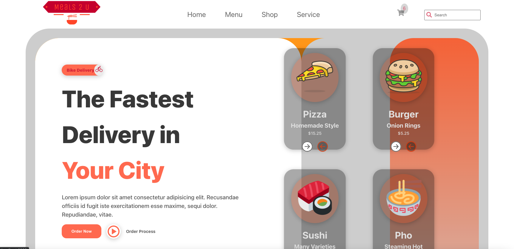

# Meals 2 U | Food Delivery Application

I decided to build a food delivery app with React JS because I thought it would be interesting and have some design elements to practice my skills with React JS instead of vanilla Javascript. Here are some pictures below as well as more info.

**Link to project: [Live-demo]https://meals2u.netlify.app**

|               Desktop               |                  Mobile                   |
| :---------------------------------: | :---------------------------------------: |
|  |  |

---

## **How It's Made:**

I worked on building out the design of the site first. I built out the individual pages with React JS and React-Router-Dom to route between them. Then I utilized styled components to write the CSS for each component within that indivdual file at the bottom. This helped to keep the code more organized and easier to locate styling for different parts of the user interface. On the shop page, I initially built out the card components to display restaurants hard-coded in one file, but later refactored it by seperating data to a different file and mapping over the data to display cards dynamically. I used media queries in plenty of spots to help with the responsiveness so the site looks good across multiple devices.

---

## **Tech used:**

HTML, CSS, Javascript, React JS, React Router Dom, Styled Components

---

## **Lesson's learned:**

This was a fun site to build with lots of things to be learned design-wise as I built it. I got more familiar with using React Router Dom to switch between pages in the application. I discovered that styled components are very useful in any non-trivial code base, and that helped immensely during the development process.

---

<!-- ## **Optimizations:**

will add more info at the end of the build.

--- -->
